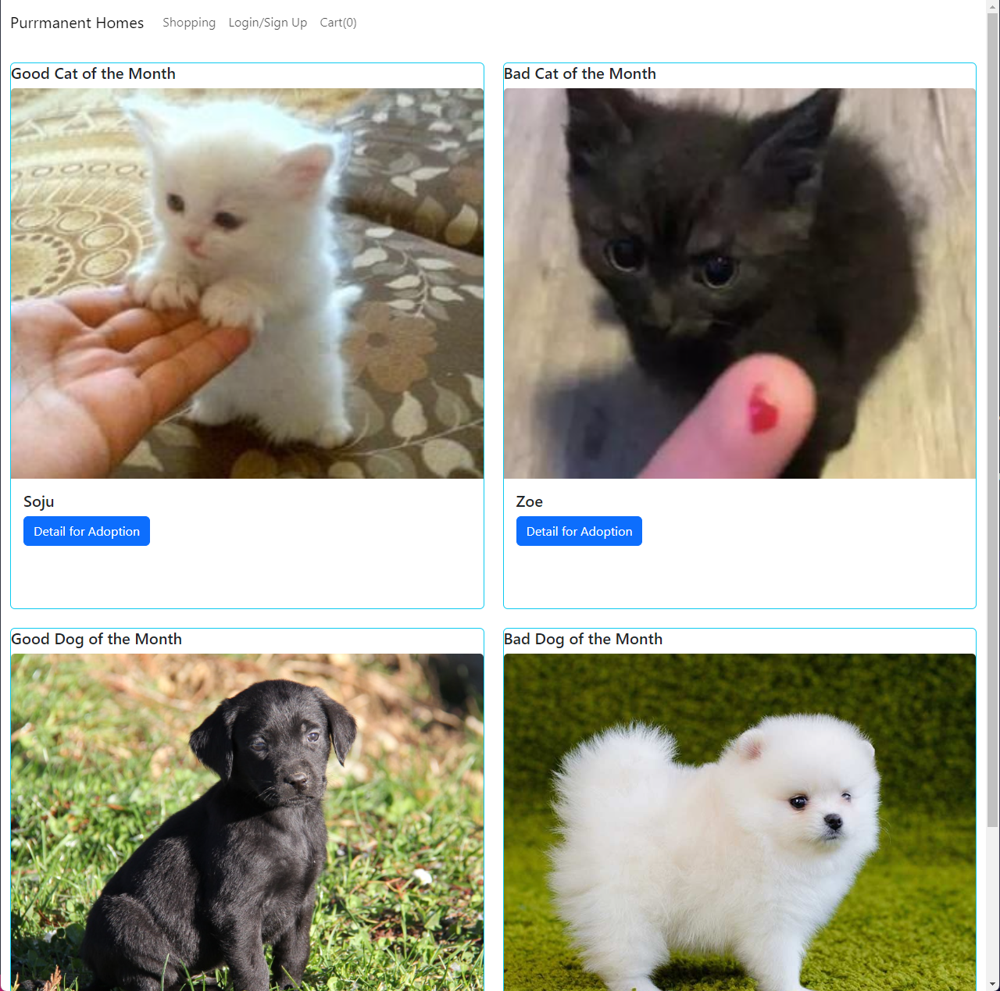
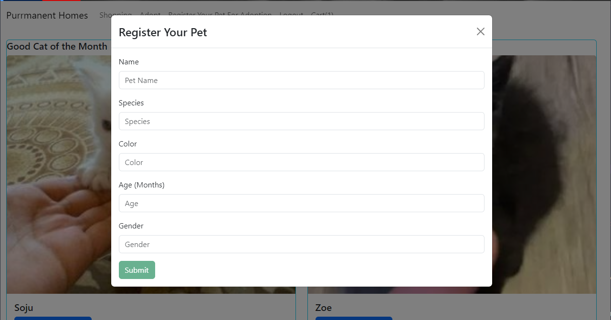

# Purrmanent Homes

## Description

Purrmanent Homes was founded to be a user friendly pet adoption website. Our team was motivated by making it easier to adopt a pet or put your pet up for adoption. By keeping a clean UI and responsive app, we were able to achieve this. Too often modern websites include too much fluff or third party features that distract from the purpose of the website. Throughout this process, we have learned how to better implement mutations and queries instead of routers. Outside of the technical side, we succeeded at working as a team and maintaining good communication and best coding practices.

## Table of Contents

- [Installation](#installation)
- [Usage](#usage)
- [Credits](#credits)
- [License](#license)

## Installation

What are the steps required to install your project? Provide a step-by-step description of how to get the development environment running.

Step 1: Git clone or fork this repository
Step 2: Make sure to install Node.js prior to use
Step 3: To install the necessary node modules, run `npm install`
Step 4: To start the server, run `npm start`
Step 5: To run both client and server side, run `npm run develop`
Step 6: To build the app, run `npm run build` or `npm run render-build` 

## Usage

Navigate to the app homepage:

To utilize the full functionality of the app, you will need to sign up or login into the app:

Select a pet to adopt a pet:

Register your pet for adoption:

Checkout from your cart:

## Credits

Xueying Li | [GitHub Link](https://github.com/snowlxy1202)
Jarett DeSanti | [GitHub Link](https://github.com/JarettDeSanti)
Dakota Wentz | [GitHub Link](https://github.com/dakotawentz)

## License

This project is under MIT License

## How to Contribute

[Contributor Covenant](https://www.contributor-covenant.org/)