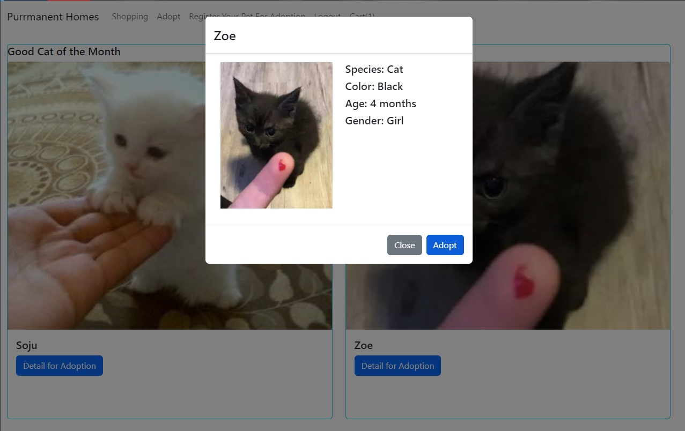

# Purrmanent Homes

## Description

Purrmanent Homes was founded to be a user friendly pet adoption website. Our team was motivated by making it easier to adopt a pet or put your pet up for adoption. By keeping a clean UI and responsive app, we were able to achieve this. Too often modern websites include too much fluff or third party features that distract from the purpose of the website. Throughout this process, we have learned how to better implement mutations and queries instead of routers. Outside of the technical side, we succeeded at working as a team and maintaining good communication and best coding practices.

## Table of Contents

- [Installation](#installation)
- [Usage](#usage)
- [Credits](#credits)
- [License](#license)

## Installation

What are the steps required to install your project? Provide a step-by-step description of how to get the development environment running.

Step 1: Git clone or fork this repository
Step 2: Make sure to install Node.js prior to use
Step 3: To install the necessary node modules, run `npm install`
Step 4: To start the server, run `npm start`
Step 5: To run both client and server side, run `npm run develop`
Step 6: To build the app, run `npm run build` or `npm run render-build` 

## Usage

Navigate to the app homepage:

To utilize the full functionality of the app, you will need to sign up or login into the app:

Select a pet to adopt a pet:

Register your pet for adoption:

Checkout from your cart:

## Credits

List your collaborators, if any, with links to their GitHub profiles.

If you used any third-party assets that require attribution, list the creators with links to their primary web presence in this section.

If you followed tutorials, include links to those here as well.

## License

The last section of a high-quality README file is the license. This lets other developers know what they can and cannot do with your project. If you need help choosing a license, refer to [https://choosealicense.com/](https://choosealicense.com/).

---

🏆 The previous sections are the bare minimum, and your project will ultimately determine the content of this document. You might also want to consider adding the following sections.

## Badges

Badges aren't necessary, per se, but they demonstrate street cred. Badges let other developers know that you know what you're doing. Check out the badges hosted by [shields.io](https://shields.io/). You may not understand what they all represent now, but you will in time.

## Features

If your project has a lot of features, list them here.

## How to Contribute

If you created an application or package and would like other developers to contribute it, you can include guidelines for how to do so. The [Contributor Covenant](https://www.contributor-covenant.org/) is an industry standard, but you can always write your own if you'd prefer.

## Tests

Go the extra mile and write tests for your application. Then provide examples on how to run them here.